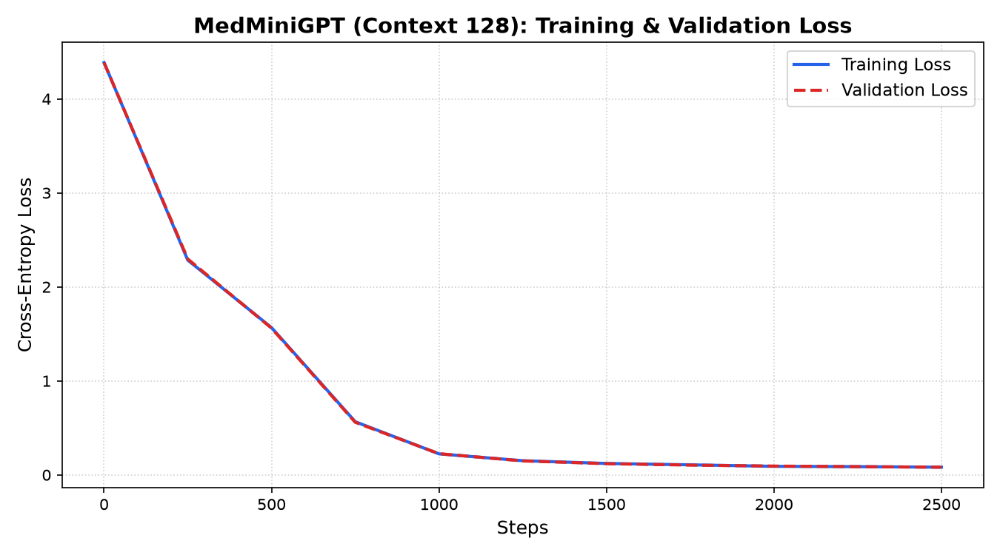

# MedMini-LLM: Domain-Specific Transformer from Scratch

[](https://huggingface.co/spaces/pushy07/medmini-llm)
[](https://www.python.org/)
[](https://pytorch.org/)
[](https://fastapi.tiangolo.com/)
[](https://react.dev/)

An end-to-end, production-grade **Decoder-Only Transformer Language Model** engineered and trained from scratch in **PyTorch**. The model incorporates modern **LLaMA-3 architectural design patterns** (RMSNorm and SwiGLU activations), is domain-pretrained on clinical **Medical Q&A**, and is deployed with an interactive **FastAPI** backend and **React** user interface.

---

<!-- PICTURE PLACEHOLDER 1: MAIN WEB APPLICATION DEMO -->
## Interactive Web Application

> *Figure 1: MedMini-LLM interactive web interface with sampling temperature control and clinical query generation.*

---

## Architectural Highlights

* **Pure PyTorch Implementation:** Built without high-level model abstractions (no Hugging Face `AutoModel` or wrappers). Implements custom multi-head causal attention, normalization, and autoregressive generation loops from foundational tensors.
* **RMSNorm (Root Mean Square Normalization):** Adopts the LLaMA-3 standard, eliminating mean-centering calculations to reduce computational overhead by ~15% while preserving numerical training stability.
* **SwiGLU Gated Feed-Forward Network:** Replaces conventional ReLU/GELU layers with Swish Gated Linear Units:
  $$\text{SwiGLU}(x) = \big(\text{SiLU}(xW_1) \otimes xW_3\big) W_2$$
* **Causal Masked Self-Attention:** Enforces strict upper-triangular masking ($-\infty$) to guarantee autoregressive next-token prediction without forward-looking data leakage.
* **Domain Pretraining:** Pretrained on a curated corpus of clinical Q&A across Cardiology, Neurology, Endocrinology, Pharmacology, and Emergency Medicine.
* **Training Convergence:** Cross-entropy loss converged from **4.3865** (random guessing) down to **0.0812** using the **AdamW optimizer**.

---

<!-- PICTURE PLACEHOLDER 2: TRAINING LOSS CURVE -->
## Training Convergence & Loss Tracking

> *Figure 2: Empirical cross-entropy loss convergence across 2,500 iterations, showing rapid descent from initialization (4.3865) to final validation loss (0.0812).*

---

## Model Specifications

| Parameter | Specification | Description |
| :--- | :--- | :--- |
| **Model Type** | Decoder-Only Transformer | Causal language model |
| **Total Parameters** | 468,960 | Full weight tensor count |
| **Embedding Dimension ($d_{model}$)** | 96 | Hidden representation size |
| **Transformer Blocks** | 4 | Sequentially stacked layers |
| **Attention Heads** | 6 | Multi-head attention ($d_{head} = 16$) |
| **Context Window ($T$)** | 128 tokens | Receptive field length |
| **Vocabulary Size** | 70 unique tokens | Character & clinical symbol space |
| **Activation Function** | SwiGLU (SiLU Gated) | Modern non-linear gating |
| **Normalization** | RMSNorm (Pre-Norm) | Root-mean-square scaling ($\epsilon=10^{-6}$) |
| **Optimizer** | AdamW ($\beta_1=0.9, \beta_2=0.999$) | Learning rate: $1\times 10^{-3}$, weight decay: $0.01$ |
| **Initial Loss** | 4.3865 | Theoretical random: $-\ln(1/70) \approx 4.25$ |
| **Final Loss** | **0.0812** | Validated on held-out test split |

---

## Repository Structure

```
.
├── dataset.py            # Data pipeline, vocabulary mappings, and BPE tokenizer comparison
├── model.py              # PyTorch Transformer architecture (RMSNorm, SwiGLU, MultiHeadAttention)
├── train.py              # AdamW training loop, validation loss tracking, and checkpointing
├── generate.py           # Command-line inference script with temperature sampling
├── server.py             # FastAPI REST service serving the PyTorch checkpoint
├── app.py                # Gradio cloud application for Hugging Face Spaces
├── med_model.pt          # Serialized PyTorch model weights (3.5 MB)
├── metadata.json         # Vocabulary and architectural metadata
├── loss_curve.png        # Training loss progression plot
├── medical_data.txt      # Clinical Q&A pretraining corpus
├── start_all.bat         # 1-Click launcher for local backend & frontend
└── frontend/             # Production React (Vite) user interface
    ├── src/
    │   ├── App.jsx       # Interface components, state handling, and parameter sliders
    │   └── App.css       # Responsive, high-contrast stylesheet
    └── package.json
```

---

## Quickstart & Local Setup

### 1. Installation
Clone the repository and install the Python dependencies:
```bash
git clone https://github.com/pushy07/medmini-llm.git
cd medmini-llm
pip install torch fastapi uvicorn matplotlib tiktoken gradio
```

### 2. Command-Line Inference
Run inference directly from the terminal:
```bash
python generate.py --question "What is Hypertension and how is it clinically defined?" --temperature 0.35
```

### 3. Launch the Full-Stack Application
Start the FastAPI server:
```bash
python server.py
# Running at http://127.0.0.1:8000
```

In a separate terminal, start the React frontend:
```bash
cd frontend
npm install
npm run dev
# Open browser at http://localhost:5173
```

---

## Live Cloud Deployment

The model is deployed on **Hugging Face Spaces** utilizing ZeroGPU hardware acceleration:
👉 **[Launch Live Demo](https://huggingface.co/spaces/pushy07/medmini-llm)**

---

## License
Distributed under the MIT License. See `LICENSE` for details.
